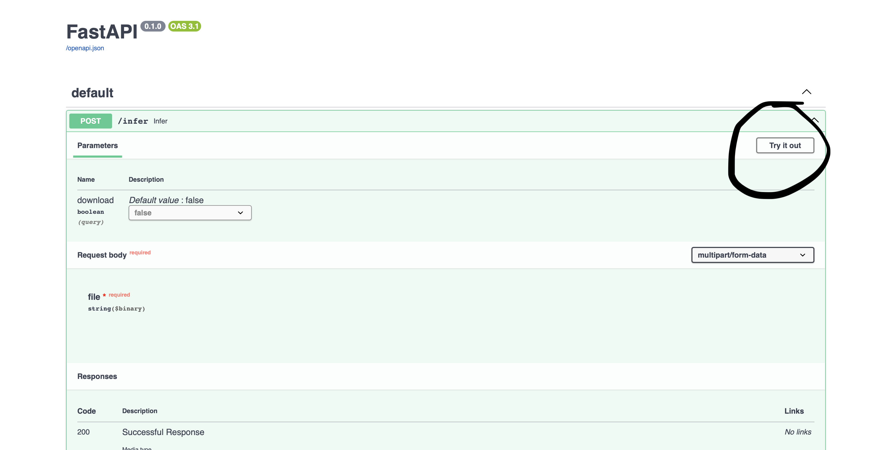
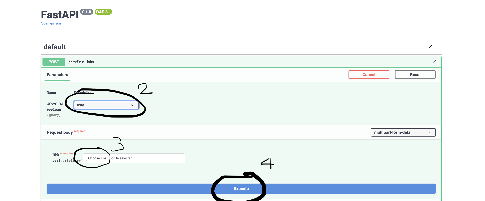

# VPBANK CHALLENGE

This repo contains source code for VPBank Challenge

## Tutorial

1. Download Docker Image from this [link]('https://drive.google.com/drive/folders/1fzfAXex8EqtqcJe0N9k12ZPeenCn9QI9?usp=sharing)
2. Move it to this directory
3. Run this command
```bash
docker compose up
```
4. Open any browser and type [http://0.0.0.0:8000](http://0.0.0.0:8000)
5. Click `Try me out`

6. Click `download` if you want to download result file to local
7. Upload your excel file
8. Click `Execute`


## Result
The result file (.xlsx) should be inside the `/workspace` directory in the container.


Good luck!